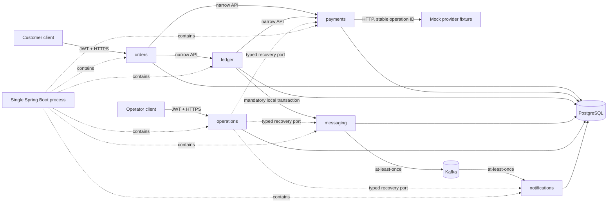
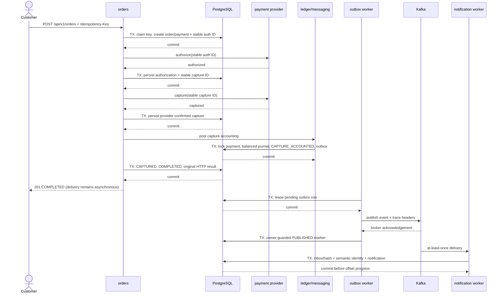

# LedgerFlow Architecture

## Status

This document defines the architectural constraints for LedgerFlow. The implemented MVP includes
the verified modular monolith, local infrastructure, complete public financial workflow,
resilience/security controls, management isolation, semantic/DLT abuse controls, end-to-end
observability, and secured operator recovery.

## Architectural goals

LedgerFlow is a single deployable application built as a modular monolith. The design should:

- keep business capabilities independently understandable and testable;
- prevent accidental coupling between capabilities;
- preserve transactional simplicity where it is valuable;
- make external contracts and persistence changes explicit;
- handle money, time, retries, and operational diagnostics safely; and
- allow later extraction of a module only when evidence justifies the cost.

A modular monolith is a logical boundary model, not a commitment to Java Platform Module System modules or future microservices. The approved bootstrap uses Gradle subprojects for compile-time feature boundaries while producing one deployable application.

## System and module view

The dashed recovery arrows are runtime port inversion: the operations module owns command leasing
and invokes typed handlers supplied by the business modules; it does not import their internals or
mutate their tables directly.

## Successful order sequence

No database transaction crosses either provider or Kafka I/O. If provider outcome is unknown,
recovery looks up the existing operation ID before a same-ID resend. If the publisher or consumer
stops after the external/database acknowledgement boundary, the work can repeat and the durable
identities absorb the duplicate.

## Code organization and module boundaries

Application code is organized package-by-feature beneath the base package `com.ledgerflow`.

The Gradle build contains one deployable `application` project and feature-library projects for `orders`, `payments`, `ledger`, `messaging`, `notifications`, and `operations`. These projects strengthen build-time boundaries but do not imply separate runtime processes or databases.

Each top-level feature package is a logical application module. Repository-wide packages such as `controller`, `service`, `repository`, `entity`, or `model` are prohibited.

A feature module should expose cross-module types through a small `<feature>.api` package. Its implementation belongs under `<feature>.internal` or other non-exported feature-local packages.

The dependency rules are:

1. A feature may depend only on another feature's `api` package.
2. A feature must not reference another feature's internal packages, repositories, entities, or database access code.
3. Feature dependency cycles are prohibited.
4. Framework and infrastructure code must not become an alternative path around feature APIs.
5. Shared code must represent a stable, genuinely cross-cutting concept. A generic `common`, `util`, or `shared` dumping ground is prohibited.
6. Every database table has one owning feature. Other features access its data through its API, not through direct repositories or SQL.

These rules are verified by the `architectureTest` task. Exceptions require an accepted ADR and a narrowly scoped automated rule describing the exception.

## Internal feature design

The default is the simplest package-by-feature design that preserves the module boundary. A feature may organize code further by cohesive use case or sub-capability.

Hexagonal architecture is not the default template for every feature. Introduce domain, application, port, and adapter boundaries only when one or more of these conditions applies:

- core rules need to remain independent of Spring or persistence;
- a feature integrates with replaceable external systems;
- multiple inbound or outbound adapters implement the same capability;
- the domain model is complex enough that infrastructure concerns obscure it; or
- isolated testing materially improves risk control.

When hexagonal architecture is used:

- domain code does not depend on Spring, HTTP, persistence, or messaging;
- inbound adapters invoke application use cases;
- outbound adapters implement ports owned by the application or domain side; and
- the reason and resulting dependency direction are recorded in an ADR or change description.

Do not introduce interfaces, mapping layers, commands, events, or duplicate models solely to imitate an architectural pattern.

The `orders` module owns the concrete public coordinator and keeps framework-free money, key, fingerprint, and order types behind one persistence port. Its named `orders.api` is the HTTP-facing use-case contract. The coordinator calls only `payments.api` and `ledger.api`; it is specific to this flow and is not a generic workflow engine. HTTP and `JdbcClient` adapters remain module-internal.

The `payments` module uses a hexagonal boundary because provider I/O is replaceable and unreliable, while the payment state machine must remain independently testable. Its application-owned `PaymentProvider` and `PaymentStore` ports isolate a JDK HTTP adapter and guarded JDBC adapter. The workflow itself is deliberately not transactional: each persistence call opens one short transaction, and no provider call or retry delay runs with a database transaction open.

The provider adapter has ordered connect, response, and overall deadlines. An overall deadline cancels the client future, but a timeout or post-send connection loss remains an unknown business outcome and must enter lookup-first recovery. An explicit classifier permits retry only for confirmed temporary failures. A count-window circuit breaker prevents repeated calls to an unavailable provider, and a zero-queue semaphore bulkhead bounds concurrent calls; confirmed business declines do not count as provider-availability failures. These controls wrap the provider port without changing payment state-machine authority or stable request IDs.

The `ledger` module keeps a framework-independent journal model because balance, immutability, and compensation rules need focused unit tests. Its small `ledger.api` is the only cross-module posting surface. Ledger posting uses the `payments.api` accounting boundary; it does not import payment internals or query payment tables. Spring transactions and JDBC remain internal adapters, and ArchUnit verifies that the ledger domain does not depend on them.

The directed feature graph is `orders -> ledger.api`, `orders -> payments.api`, `ledger -> payments.api`, and `ledger -> messaging.api`. Capture accounting locks the payment, inserts the journal, marks `CAPTURE_ACCOUNTED`, and invokes the mandatory-transaction outbox appender. The orders coordinator then finalizes through `payments.api`; payments, messaging, and ledger never call orders, so the graph remains acyclic.

The `messaging.api.OutboxEventAppender` is deliberately narrow: it appends one typed payment-captured event only when a caller already owns a PostgreSQL transaction. The messaging module owns canonical envelope serialization, outbox persistence, leases, retry timing, Kafka publication, and W3C trace-header injection. The notifications module owns validation, inbox deduplication, notification persistence, bounded consumer retry, the DLT catalog, and audited replay. Neither consumer nor replay path may call ledger or mutate financial state.

The `operations.api` package exposes in-flight work registration, allowlisted fault hooks, and a
narrow typed recovery-handler contract. Provider, publisher, and consumer adapters depend on the
operational controls so shutdown can stop admission and drain known work within a bounded phase.
Operations internals own dependency probes, readiness, startup validation, sanitized recovery
projection/acceptance/audit, and leased dispatch. Domain recovery remains in handlers owned by
orders, messaging, and notifications; operations never accepts replacement provider/event data or
bypasses their idempotency rules.

ADR 0004 accepts one narrow database-boundary exception: the payment-owned `V002` constraint trigger reads only an order's ID, amount, and currency to reject a payment whose copied money differs from its referenced order. Application code still cannot query another module's tables, and a PostgreSQL integration test verifies this invariant. This exception does not authorize general cross-module SQL.

ADR 0005 accepts a second narrow database-integrity exception: `V003` adds the payment-owned `CAPTURE_ACCOUNTED` state constraints, and the ledger's deferred validator reads only the referenced payment's state, order ID, amount, and currency. This is necessary to prevent payment accounting status and its journal from diverging at commit. Ledger application code still uses `payments.api` and never queries the payment table. Any expansion of this trigger contract requires a new ADR review.

ADR 0013 accepts a third narrow database-integrity exception: V008's deferred terminal-workflow validator reads one order, its unique payment, capture journal identity, and immutable outbox identity. It rejects `COMPLETED` without `CAPTURED` plus journal/outbox evidence and rejects decline/retry/failed order states that contradict payment state. Application code still uses module APIs. The trigger is a final-state backstop, not an orchestration path and not authorization for general cross-module SQL.

## HTTP contracts

The version-controlled OpenAPI document at `application/src/main/openapi/ledgerflow.yaml` is the source of truth for public HTTP APIs. The test-only external provider contract at `application/src/testFixtures/openapi/mock-payment-provider.yaml` is validated separately and is not a public LedgerFlow API.

An HTTP change must:

- update the OpenAPI contract before or with implementation;
- pass `openApiValidate`;
- include tests for affected status codes, media types, validation, and schemas; and
- document compatibility and migration behavior for breaking changes.

The MVP keeps server interfaces and models hand-written and validates the authoritative contract
plus HTTP behavior in the build. Generated code is not part of the delivered repository.

## Persistence

Production persistence uses PostgreSQL. Integration tests use a PostgreSQL Testcontainer compatible with the production major version. H2 is prohibited because its SQL and transactional behavior do not provide adequate PostgreSQL compatibility.

Flyway migrations live under `application/src/main/resources/db/migration` and are the only supported mechanism for production schema changes.

Migration rules:

- migrations are append-only after merge;
- a correction to a merged migration is a new forward migration;
- application changes and required migrations are delivered together;
- integration tests start from an empty PostgreSQL database and apply every migration;
- destructive or long-running migrations require a reviewed plan with compatibility, recovery, and rollout details; and
- a module accesses only tables it owns unless an accepted ADR defines a controlled exception.

The current local, production-design, and integration-test baseline is PostgreSQL 18. Migrations use ordered `VNNN__description.sql` names. V001–V007 own the previously described feature data; V008 adds resumable idempotency shape, final order/payment states, and deferred workflow-finalization invariants; V009 adds secured operator retry, lease, cooldown, approval, and immutable audit state. No merged migration is edited. The release inventory is [migration inventory](migration-inventory.md).

### Capture-accounting transaction and isolation boundary

Payment-provider I/O completes before accounting starts. `LedgerPosting.postPaymentCapture` then opens one PostgreSQL `READ COMMITTED` transaction and performs this sequence:

1. lock the payment row through `payments.api` using `SELECT ... FOR UPDATE`;
2. accept `CAPTURE_CONFIRMED`, or verify and replay an existing `CAPTURE_ACCOUNTED`/`CAPTURED` journal;
3. insert one journal header and all entries;
4. transition the locked payment to `CAPTURE_ACCOUNTED` with its expected version;
5. append one immutable, deduplicated payment-captured outbox row through `messaging.api`; and
6. let deferred ledger constraints validate the complete journal before commit.

The payment row is the same-payment serialization point. Under `READ_COMMITTED`, a waiter observes accounted/final state and verifies the existing journal/outbox. Unique journal and outbox keys remain backstops. A failure rolls back payment accounting, journal, entries, and event together. A separate short transaction locks the HTTP idempotency row, changes `CAPTURE_ACCOUNTED -> CAPTURED` through `payments.api`, changes the order to `COMPLETED`, and stores the original response. Deferred V008 validation sees both final transitions at commit. This separation creates a recoverable crash window, not false atomicity: after accounting but before finalization, replay verifies and completes the durable effects.

Posted ledger rows reject update and delete. Corrections append an exact reversing transaction linked to the original rather than mutating history. Production privileges must prevent the application role from disabling triggers or applying DDL; the current local/test owner credential is a development convenience, not the production authorization model.

### Outbox publication and notification consumption

The dedicated publisher uses short owner-token lease transactions. Each instance claims due or expired rows with `SELECT ... FOR UPDATE SKIP LOCKED`, commits the claim, publishes outside PostgreSQL, waits for `acks=all`, and then marks the row `PUBLISHED` only through an owner-guarded update. Multiple instances can work concurrently. A send may therefore be duplicated if the process stops after broker acknowledgement but before the marker commits.

Publication has at most 10 attempts per cycle with exponential backoff capped at 256 seconds and configurable jitter. Failed rows remain durable and inspectable; the secured operator API can request one bounded recovery cycle without replacing the event identity or cumulative history. The default main topic is `ledgerflow.payment-captured.v1`, keyed by order ID.

The notification listener validates the exact envelope, key, type, version, money, and identity relationships. Intake is bounded by configured listener concurrency and `max.poll.records`. It makes one initial attempt plus three bounded retries for transient failures; retry delays pause the affected container/partition while polling continues for consumer-group liveness. A poison record is published to `ledgerflow.payment-captured.v1.dlt` and acknowledged before the source offset advances. Inbox event-ID/hash deduplication makes a matching redelivery of the same envelope a transport no-op; the same event ID with different canonical content is an integrity failure.

A separate database-unique semantic-effect identity prevents re-enveloping from repeating a business side effect. Payment-captured notification identity version 1 uses the immutable capture ledger transaction ID, not only payment ID or event ID. A new event ID with the same semantic identity and compared order/payment/causation/money/capture-time content records a `SEMANTIC_DUPLICATE` inbox outcome without a second notification. Conflicting content for that identity rolls back the new inbox row and becomes a non-replayable integrity failure. Concurrent envelopes converge on the same unique constraint.

The DLT listener catalogs validated, bounded safe evidence in `dead_letter_records`. Missing,
repeated, malformed, or unsupported original-routing headers and empty, oversized, or invalid event
data instead produce one immutable `terminal_dlt_records` row keyed by the actual DLT topic,
partition, and offset. It contains bounded hashes, sizes, allowlisted headers, and a stable code,
never raw poison bytes or invented original coordinates. The DLT offset advances only after this
evidence commits; a database failure retains the record for redelivery. Secured recovery accepts
only catalog rows already marked replayable and preserves their stored event identity, key, and
canonical body. There is no general Kafka resend or direct mutation path.

These boundaries provide atomic PostgreSQL business data plus outbox, at-least-once publication, and at-least-once consumption. Transport idempotency and semantic-effect idempotency prevent duplicate notification rows for the covered capture effect, including re-enveloping, but duplicate delivery remains observable and other future effects need their own identities. LedgerFlow does not claim end-to-end exactly-once delivery.

## Runtime health and shutdown

Spring Boot graceful shutdown stops HTTP admission. Kafka listener containers stop without abandoning a record and use an explicit shutdown timeout; outbox and retry schedulers wait for active tasks. The operations work tracker stops last, refuses new tracked work, and waits for active provider, outbox, and notification work. Exceeding the drain deadline emits an error and leaves an observable failed-drain state rather than claiming a clean shutdown.

Actuator runs on a configurable management listener, separate from the application listener. The application port serves no Actuator path. The management context permits only status-only `/actuator/health/liveness`, status-only `/actuator/health/readiness`, and Prometheus; aggregate health, component details, and `info` are not exposed. This application-layer policy is defense in depth: deployment must route the application port only to customer/operator ingress and restrict the management port to health-probe and monitoring sources as specified in [deployment security](deployment-security.md).

Liveness contains process state only and deliberately excludes PostgreSQL, Kafka, and the provider. Readiness includes process readiness plus the bounded LedgerFlow dependency probe. Concurrent requests share one in-flight computation and cache success or failure for a bounded two-second default TTL. The dependency probe reuses one lifecycle-managed, lazily created Kafka Admin instead of allocating a client per request. Startup validation deliberately bypasses this cache. PostgreSQL is required at startup. Kafka is checked at startup and readiness when publisher or consumer adapters are enabled; broker failure never deletes or rewrites durable outbox data.

Controlled fault injection is a local/test mechanism with an explicit point allowlist, bounded delay, and fail/delay modes. Production startup rejects `ledgerflow.fault-injection.enabled=true` unless an allowed local or test profile is active. This guard supplements deployment policy; it is not a public control API.

## Money and time

A monetary amount consists of:

- a signed 64-bit integer count of minor units; and
- an uppercase three-letter ISO 4217 currency code.

Java uses a dedicated money value type backed by `long`; HTTP schemas use an `int64` amount and currency code; PostgreSQL uses an integer-compatible exact type. Monetary arithmetic must check overflow and define rounding explicitly where conversion or allocation occurs. `float` and `double` are prohibited for monetary storage, transport, and calculation.

Persisted points in time use `Instant` and PostgreSQL `timestamptz`. Services, tests, and serialization operate in UTC. Calendar dates, local times, durations, and accounting periods may use more appropriate types when they are not instants. A clock is injected where business behavior depends on the current time.

## Idempotent writes

Any write operation expected to be retried by an external client, webhook sender, scheduler, or message transport must define its idempotency behavior in its contract.

For HTTP operations requiring idempotency:

- the OpenAPI operation declares an `Idempotency-Key` header;
- the key is scoped to the operation and authenticated caller where applicable;
- the request fingerprint and outcome are persisted atomically with the business change;
- repeating the same key and equivalent request returns the original outcome;
- reusing the same key with a different request is rejected as a conflict;
- concurrent requests with the same key cannot apply the write twice; and
- retention and replay behavior are documented for the operation.

Integration tests must cover replay, mismatched reuse, concurrency, and failure recovery.

## HTTP security boundary

LedgerFlow is a stateless OAuth 2.0/OIDC JWT resource server; it never issues tokens or accepts
cookie authentication. Production JWT trust requires the configured exact issuer and
`ledgerflow-api` audience, RS256 signatures, valid expiry/not-before claims, a route-specific
scope, and an allowlisted Keycloak realm role. Active order routes require `customer` or `admin`;
operator reads require `operator` or `admin` plus the read scope; retry writes require the retry
scope; and break-glass approval requires its separate scope plus `admin`.

Object authorization belongs in the owning query boundary. Order reads constrain both order ID
and JWT subject and return the same `404` for absent and differently owned resources. HTTP route
authorization is necessary but is not a substitute for this database predicate.

Untrusted HTTP input has byte, structure, media-type, and header bounds before business work.
Create Order additionally rejects query parameters, compressed bodies, unknown/duplicate JSON
members, and applies a bounded per-instance subject limiter. The limiter stores only SHA-256
subject hashes and is defense in depth; a trusted ingress must provide deployment-wide and
unauthenticated volumetric protection. Secure response headers apply to success and problem
responses, with HSTS emitted only for HTTPS.

## Observability and secrets

Production logs are ECS JSON records with stable event, action, outcome, and error codes rather than free-form concatenated input. Every inbound request accepts a validated `X-Correlation-Id` or creates one, returns it in the response, and places only the safe value in log context. Invalid correlation and W3C headers are discarded and replaced; they are never echoed or parsed into telemetry labels.

Spring HTTP server observations consume and produce W3C trace context. The provider adapter creates client spans and injects the current context. The order coordinator, capture-accounting boundary, outbox append, and notification persistence add bounded spans around the PostgreSQL work without recording SQL parameters. Outbox rows persist the originating `traceparent`/`tracestate`; the publisher restores that parent, creates a Kafka producer span, and Kafka listener observations extract it before notification work. These implemented boundaries retain causal continuity, so direct parentage is accurate. Independent operator worker spans start new roots and link to the authenticated retry request and trustworthy stored origin rather than asserting false parentage.

Micrometer publishes HTTP, JVM, thread, executor, HikariCP, Kafka-client, readiness/drain, and business metrics through Prometheus on the isolated management listener only. Every `ledgerflow.*` label key and value is code-allowlisted. IDs, subjects, coordinates, hashes, URLs containing identifiers, exception text, and personal/security values are forbidden labels. Outbox backlog uses a fixed-rate cached aggregate rather than a database query per scrape.

Structured logs and custom spans must not contain credentials, bearer tokens, authorization/cookie headers, idempotency keys, payment references, secret configuration, provider or Kafka bodies, poison bytes, SQL parameters, full financial payloads, exception text, or unnecessary personal data. OTLP queues, batches, connect timeouts, and export deadlines are bounded. Export failure may lose telemetry but must not change a business transaction.

The local Collector sends traces to Tempo and logs to Loki; Prometheus scrapes the management listener and Collector self-metrics; Grafana data sources, five dashboards, trace/log links, alert rules, and runbooks are version controlled. The detailed signal contracts, label allowlist, demonstration, SLIs, and provisional SLOs are in [observability](observability.md). Local evidence is not a production availability guarantee.

Secrets are supplied through environment variables or an approved secret-management system. Source code, configuration, fixtures, documentation, and example files contain placeholders only. `scripts/security-scan` uses a version-and-digest-pinned build container to scan committed content, packaged dependencies, and every Compose image. Its vulnerability database must be refreshed in CI. Secret and packaged-application findings have no exception path. The only current image exceptions are exact, digest-bound tuples in the [local-development container risk register](security/local-development-container-risk-register.md); they expire, remain visible, and are invalid for production.

## Automated architecture verification

The Gradle `architectureTest` task must verify at least:

- feature modules do not access another feature's internals;
- module dependencies are acyclic;
- repository-wide technical-layer packages are absent;
- domain packages declared as hexagonal do not depend on Spring or adapters;
- forbidden monetary floating-point types are not used;
- persistence code does not introduce H2; and
- documented exceptions correspond to explicit test rules.

Spring Modulith verifies logical application modules, API/internal access, and cycles. ArchUnit complements it with repository-specific package rules. Both run through `architectureTest`.

## Local development infrastructure

`compose.yaml` provides pinned local dependencies for development and demonstrations. It is not production topology or authorization guidance. Services bind only to `127.0.0.1`, have bounded laptop-oriented resources and health checks, and are operated through `scripts/dev-*`.

Keycloak stores its data in a separate database on the local PostgreSQL instance; embedded H2 is not used. The imported realm defines `customer`, `operator`, and `admin` roles, order/operation scopes, and the API audience mapper without users or credentials. Valkey is an ephemeral Redis-compatible cache service and is not an approved application datastore. Local Kafka uses Apache's official native 4.3.1 image as a single combined broker/controller in KRaft mode; the native distribution was selected over the equivalent JVM image after fixed HIGH image findings were detected. Prometheus, Grafana, Tempo, Loki, and OpenTelemetry Collector provide a self-contained observability path without committing credentials or choosing a production observability vendor.

The public workflow accepts ADR 0013, builds on ADR 0003's scoped idempotency and ADR 0004's provider state machine, and invokes the deterministic HTTP provider fixture only in local/test demonstrations. Capture accounting accepts ADR 0005, and the implemented outbox/Kafka behavior accepts ADRs 0006 and 0007 within their documented scope. ADRs 0010 through 0012 define management isolation, notification semantic identity, and terminal malformed-DLT evidence. Production identity, a real payment provider, broker security, persistence roles, deployment topology, TLS, retention, backup, and sizing remain subject to approved implementation or deployment milestones.

## Decisions intentionally deferred

The following require product or operational evidence and are not selected by this document:

- public API versioning policy;
- OpenAPI code generation;
- deployment platform and topology;
- caches, search engines, or additional datastores;
- extraction into independently deployed services.

These decisions require an approved milestone and, when significant, an ADR.
