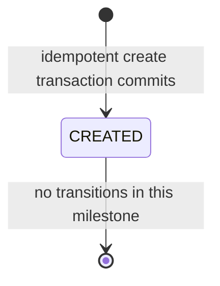
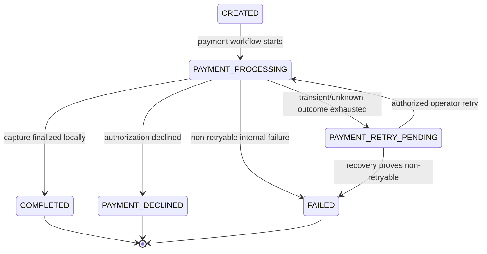
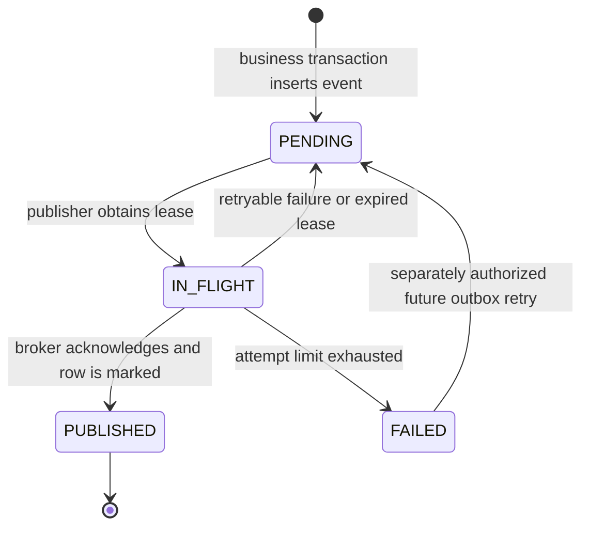
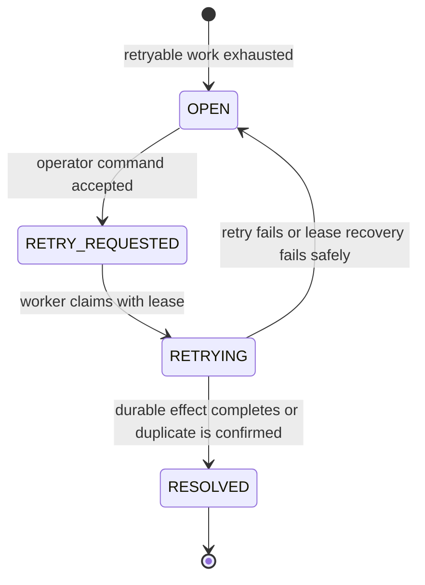

# LedgerFlow MVP Domain Model

- Status: Partially implemented
- Last updated: 2026-07-13

## Bounded modules

| Module | Owns | Exposes to other modules |
| --- | --- | --- |
| `orders` | Order aggregate, order HTTP idempotency, workflow coordination | Create/read order and guarded order transitions |
| `payments` | Payment aggregate, attempts, provider port and HTTP adapter | Start, reconcile, and finalize authorization/capture |
| `ledger` | Accounts, ledger transactions, entries, balance invariant | Post a payment-capture transaction idempotently |
| `messaging` | Transactional outbox and Kafka publisher | Append an event in the caller's transaction |
| `notifications` | Kafka inbox and notification records | Idempotent payment-captured event handling |
| `operations` | Sanitized failed-operation projection, retry requests, audit | Inspect failures and dispatch authorized retry commands |

The modules are packages in one deployable application. Cross-module calls use each module's `api` package. Capture accounting deliberately spans `ledger.api`, `payments.api`, and `messaging.api` inside one local PostgreSQL transaction; application code in none of those modules queries another module's tables directly. ADR 0005 separately permits the deferred database validator's narrow payment-state/money consistency read. Order completion and a final payment `CAPTURED` transition remain unimplemented.

The `payments` module uses hexagonal architecture because it owns a non-trivial state machine and a replaceable external HTTP provider. Other modules use simpler package-by-feature structures unless their implementation evidence justifies additional ports.

## Ubiquitous language

- **Order:** The customer's request to pay one positive INR amount.
- **Payment:** The local lifecycle for authorizing and capturing the order amount.
- **Provider operation key:** A stable identifier for one logical authorization or capture, reused for provider retries and lookup.
- **Ledger transaction:** An immutable balanced group of entries representing one captured payment.
- **Ledger entry:** One debit or credit in integer minor units and one currency.
- **Outbox event:** A domain event stored in the same transaction as the business state it describes.
- **Inbox record:** Proof that a consumer has applied or is atomically applying one event ID.
- **Notification:** The durable record created after consuming a payment-captured event; delivery is outside MVP scope.
- **Failed operation:** A sanitized, operator-visible record for work that exhausted automatic recovery or reached a retryable uncertain state.
- **Retry request:** An idempotent, audited operator command to resume one failed operation.

## Value objects and identifiers

- Order, payment, and payment-history IDs are PostgreSQL-generated UUIDv7 values. Provider request IDs are independently generated UUIDs and remain stable for one logical authorization or capture. All IDs are opaque in APIs.
- `Money` is `{ amountMinor: long, currency: "INR" }`; `amountMinor` must be greater than zero.
- `CorrelationId` is 1–64 characters matching `[A-Za-z0-9._-]+`; invalid inbound values are replaced with a generated UUID.
- `Idempotency-Key` is 8–128 characters matching `[A-Za-z0-9._:-]+`. Only its SHA-256 hash is persisted.
- `RequestFingerprint` is SHA-256 over the normalized validated business request.
- Persisted timestamps are `Instant` values serialized in UTC. The current order timestamps are generated by PostgreSQL in the creation transaction.
- Outbox event IDs are PostgreSQL-generated UUIDv7 values. Provider capture request IDs are stable UUIDs and become payment-captured event causation IDs. Future operation IDs must be opaque and never reused.

## Order aggregate

The implemented order contains its UUIDv7 ID, owner subject, optional client reference, positive INR money, `CREATED` status, reserved optimistic version, initial correlation ID, and UTC timestamps. The public order workflow does not create or expose a payment yet; the payment integration harness links test payments to existing orders without changing order state.

The active state machine is deliberately small:

| From | Command/result | To | Guard and effects |
| --- | --- | --- | --- |
| New | Accept order | `CREATED` | Unique scoped key; valid positive INR money; response snapshot commits atomically |

Payment-related order transitions below are proposed for Milestone 5 and are not implemented:

| From | Command/result | To | Guard and effects |
| --- | --- | --- | --- |
| `CREATED` | Start payment | `PAYMENT_PROCESSING` | Requires the separately approved order/payment integration milestone |
| `PAYMENT_PROCESSING` | Capture finalization | `COMPLETED` | Payment becomes `CAPTURED`; balanced ledger and outbox commit atomically |
| `PAYMENT_PROCESSING` | Provider decline | `PAYMENT_DECLINED` | Payment is a decline state; no ledger or outbox |
| `PAYMENT_PROCESSING` | Retryable outcome exhausted | `PAYMENT_RETRY_PENDING` | Failed operation is open; no ledger or outbox |
| `PAYMENT_PROCESSING` | Non-retryable internal failure | `FAILED` | Failure is recorded and requires investigation |
| `PAYMENT_RETRY_PENDING` | Accepted retry request | `PAYMENT_PROCESSING` | Retry request is unique and operation is retryable |
| `PAYMENT_RETRY_PENDING` | Reconciliation proves non-retryable | `FAILED` | Safe failure evidence is recorded; no financial/event effect |

Terminal order states are immutable in the MVP. Refunds and corrective order transitions require a future design.

## Payment aggregate

An implemented payment contains its UUIDv7 ID, order ID, positive INR money, state, current resume stage, restricted test-provider payment-method reference, stable and independent authorization/capture request IDs, sanitized provider references and failure code, attempt counters, optimistic version, and UTC timestamps. The payment-method reference is cleared after authorization resolves and is never exposed through public responses, events, logs, traces, or operator views.

```mermaid
stateDiagram-v2
    [*] --> CREATED
    CREATED --> AUTHORIZING: begin authorization
    AUTHORIZING --> AUTHORIZED: provider authorized
    AUTHORIZING --> DECLINED: provider declined
    AUTHORIZING --> AUTHORIZATION_RETRY_PENDING: temporary failure exhausted
    AUTHORIZING --> AUTHORIZATION_UNKNOWN: timeout remains ambiguous
    AUTHORIZING --> FAILED: invalid provider response
    AUTHORIZATION_RETRY_PENDING --> AUTHORIZING: retry same request ID
    AUTHORIZATION_UNKNOWN --> AUTHORIZED: lookup confirms success
    AUTHORIZATION_UNKNOWN --> DECLINED: lookup confirms decline
    AUTHORIZATION_UNKNOWN --> AUTHORIZING: lookup proves not found
    AUTHORIZED --> CAPTURING: begin capture
    CAPTURING --> CAPTURE_CONFIRMED: provider capture confirmed
    CAPTURING --> CAPTURE_DECLINED: provider declined capture
    CAPTURING --> CAPTURE_RETRY_PENDING: temporary failure exhausted
    CAPTURING --> CAPTURE_UNKNOWN: timeout remains ambiguous
    CAPTURING --> FAILED: invalid provider response
    CAPTURE_RETRY_PENDING --> CAPTURING: retry same request ID
    CAPTURE_UNKNOWN --> CAPTURE_CONFIRMED: lookup confirms success
    CAPTURE_UNKNOWN --> CAPTURE_DECLINED: lookup confirms decline
    CAPTURE_UNKNOWN --> CAPTURING: lookup proves not found
    AUTHORIZATION_UNKNOWN --> FAILED: non-retryable recovery result
    CAPTURE_UNKNOWN --> FAILED: non-retryable recovery result
    DECLINED --> [*]
    CAPTURE_DECLINED --> [*]
    CAPTURE_CONFIRMED --> CAPTURE_ACCOUNTED: balanced journal commits atomically
    CAPTURE_ACCOUNTED --> [*]: journal and outbox are durable; order finalization remains future
    FAILED --> [*]
```

| State | Permitted next states | Required evidence |
| --- | --- | --- |
| `CREATED` | `AUTHORIZING` | Persisted stable authorization operation key |
| `AUTHORIZING` | `AUTHORIZED`, `DECLINED`, `AUTHORIZATION_RETRY_PENDING`, `AUTHORIZATION_UNKNOWN`, `FAILED` | Provider response or reconciled lookup result |
| `AUTHORIZATION_RETRY_PENDING` | `AUTHORIZING` | Explicit retry with the same authorization request ID |
| `AUTHORIZATION_UNKNOWN` | `AUTHORIZED`, `DECLINED`, `AUTHORIZING`, `FAILED` | Lookup result; resend only after `NOT_FOUND`, using the same request ID |
| `AUTHORIZED` | `CAPTURING` | Provider authorization reference exists |
| `CAPTURING` | `CAPTURE_CONFIRMED`, `CAPTURE_DECLINED`, `CAPTURE_RETRY_PENDING`, `CAPTURE_UNKNOWN`, `FAILED` | Provider response or reconciled lookup result |
| `CAPTURE_RETRY_PENDING` | `CAPTURING` | Explicit retry with the same capture request ID |
| `CAPTURE_UNKNOWN` | `CAPTURE_CONFIRMED`, `CAPTURE_DECLINED`, `CAPTURING`, `FAILED` | Lookup result; resend only after `NOT_FOUND`, using the same request ID |
| `CAPTURE_CONFIRMED` | `CAPTURE_ACCOUNTED` | Provider capture reference exists; payment row and balanced journal commit together |
| `CAPTURE_ACCOUNTED` | None in the current milestone | Exactly one matching capture journal and payment-captured outbox event exist; a later workflow may add final order/payment states without emitting this effect again |
| `DECLINED`, `CAPTURE_DECLINED`, `FAILED` | None | Sanitized terminal reason exists |

Every transition validates its source in the domain and compares the persisted version and expected state in SQL. Illegal transitions throw a domain error; stale concurrent transitions throw an optimistic-concurrency error and make no change. Provider I/O and retry delay happen after a committed transition to `AUTHORIZING` or `CAPTURING`, and each classified result is committed later with an append-only history event.

### Provider result classification

| Provider result | Classification | Behavior |
| --- | --- | --- |
| Success | Final success | Persist provider reference and continue |
| Decline | Final business outcome | Enter explicit decline state; never retry automatically |
| HTTP 429/5xx or connection failure | Temporary | Retry once using the same operation key, then open a failed operation |
| Read timeout or connection loss after send | Unknown | Query by operation key; resend only if lookup proves no provider effect |
| Malformed or contradictory response | Non-retryable | Enter `FAILED`, record sanitized evidence, alert operator |

## Ledger model

The MVP seeds two INR accounts:

- `PAYMENT_CLEARING`, an asset account debited when cash is captured; and
- `MERCHANT_PAYABLE`, a liability account credited for captured funds owed to the merchant.

One provider-confirmed capture produces one immutable `PAYMENT_CAPTURE` transaction:

| Account | Side | Amount |
| --- | --- | --- |
| `PAYMENT_CLEARING` | Debit | Order amount in INR minor units |
| `MERCHANT_PAYABLE` | Credit | Order amount in INR minor units |

Ledger invariants:

- every journal transaction contains two or more entries;
- the payment-capture posting contains exactly the two MVP entries shown above;
- each amount is positive and uses the transaction currency;
- total debits equal total credits per currency;
- account currency matches entry currency;
- every transaction carries its payment/order link, source identity, correlation ID, actor, and UTC posting time;
- `(source_type, source_id)` and a payment-capture partial unique index make capture posting idempotent;
- entries and transactions are immutable; one replayable `CORRECTION` transaction reverses the original entries exactly; and
- the database rechecks the aggregate balance at commit through a deferred constraint trigger.

Capture posting locks the payment, accepts only `CAPTURE_CONFIRMED` or a matching replay in `CAPTURE_ACCOUNTED`, and makes the state transition, journal, and payment-captured outbox append one atomic local transaction. The outbox append uses the provider capture request UUID as stable causation. A correction changes ledger balances through new debit/credit evidence; it does not rewind provider state, emit another payment-captured event, or imply a refund.

## Outbox lifecycle

Multiple publisher instances claim work with short `SKIP LOCKED` lease transactions, then publish outside PostgreSQL. The publisher may send the same event more than once if it crashes after broker acknowledgement but before its owner-guarded marker commits. It must never mark `PUBLISHED` before acknowledgement. Lease expiry makes abandoned work eligible again; a cycle stops after 10 attempts using bounded exponential backoff and jitter.

## Notification consumption

The `PaymentCaptured` handler validates the envelope, type, and version, computes a canonical payload hash, and then executes one PostgreSQL transaction:

1. insert the event ID and hash into the inbox, or read the existing row on conflict;
2. if the event ID exists with the same hash, treat delivery as successfully handled;
3. if the event ID exists with a different hash, roll back and raise a non-retryable integrity failure for direct DLT;
4. insert one notification with a unique event ID; and
5. commit before acknowledging the Kafka offset.

Transient failures receive one initial processing attempt plus three bounded pause-based retries. The listener continues polling while the affected work is paused, and configured concurrency, poll count, and fetch bytes bound intake. Invalid type/version/integrity input goes directly to DLT; repeatedly failing transient input reaches it after that retry budget. The source record is acknowledged only after the DLT publication is acknowledged. Replaying the same valid event ID remains safe because of the inbox hash and notification unique constraints.

The DLT catalog stores bounded, sanitized source coordinates, hash/size, safe headers, and a validated replay envelope/key only when parsing succeeds. A replayable record can be claimed by the narrow command-line tool with an actor and reason; the tool generates new transport correlation/trace context. Replay preserves the event envelope and key and appends immutable replay audit rows. It never edits the inbox, notification, outbox, or Kafka offsets directly.

## Planned failed-operation lifecycle

This general operator model is not implemented. A future HTTP operations workflow may use the lifecycle above. The current Kafka milestone provides only a narrow audited CLI for replayable DLT catalog rows; it does not create `failed_operations`, expose operator endpoints, or provide outbox/payment retry commands.

## Transaction boundaries and crash recovery

Rows explicitly marked future remain planned for later milestones.

| Boundary | Atomic work | Important crash behavior |
| --- | --- | --- |
| Accept order | Idempotency claim, `CREATED` order, immutable `201` snapshot | All commit or roll back; unique key prevents a second order |
| Start provider stage | Guarded payment transition and durable attempt evidence | Recovery sees durable work before external call |
| Record provider result | Payment transition and append-only result evidence | Optimistic guard accepts one classified outcome |
| Account confirmed capture | Payment `CAPTURE_ACCOUNTED`, ledger transaction and entries, payment-captured outbox event | Payment row lock serializes duplicates; deferred checks and outbox deduplication commit all or roll back all |
| Complete order/payment (future) | Any later final states and cached HTTP result | Must require existing accounted journal/outbox and must not duplicate the capture event |
| Publish outbox | Lease claim, then broker send, then owner-guarded published marker | Duplicate publication is possible after acknowledgement; lease recovery republishes the same event ID |
| Consume event | Inbox and notification | Same ID/hash redelivery is a successful no-op; different content is an integrity failure |
| Accept operator retry (future) | Retry request, operation status, audit | Duplicate command does not schedule duplicate work |

Provider capture and PostgreSQL cannot be one transaction. If capture succeeds but local persistence fails, recovery looks up the stable capture operation key and restores `CAPTURE_CONFIRMED`. Capture accounting can then be retried safely: either it atomically creates the journal, `CAPTURE_ACCOUNTED`, and outbox event, or it returns the already matching journal and event.

## Domain events

Capture accounting appends event type `com.ledgerflow.payment.captured` with schema version `1`. The canonical envelope fields, in order, are `eventId`, `eventType`, `schemaVersion`, `aggregateId`, `correlationId`, `causationId`, `occurredAt`, and `data`. `aggregateId` is the payment ID; `causationId` is the stable provider capture request UUID. The data contains only:

- order ID;
- payment ID;
- ledger transaction ID;
- amount minor and currency; and
- capture timestamp.

Payment method tokens, idempotency keys, raw provider responses, JWTs, and error stack traces never appear in events.
