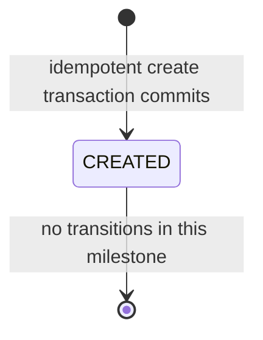
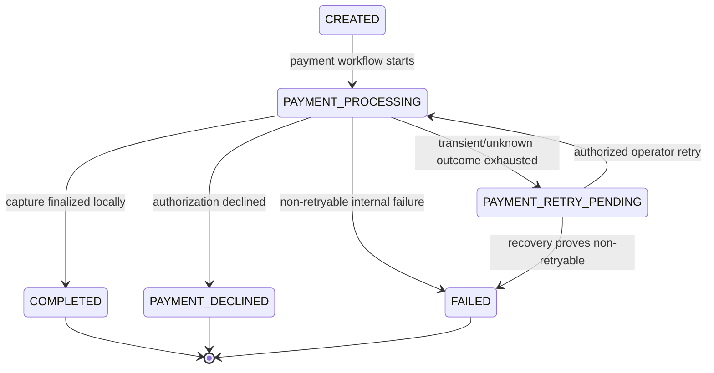
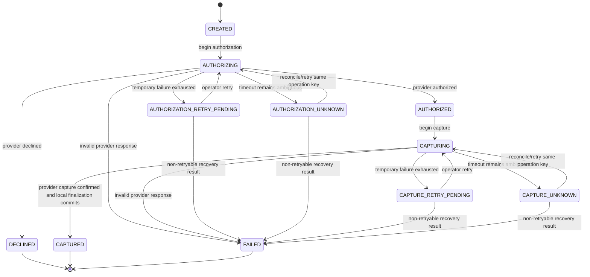
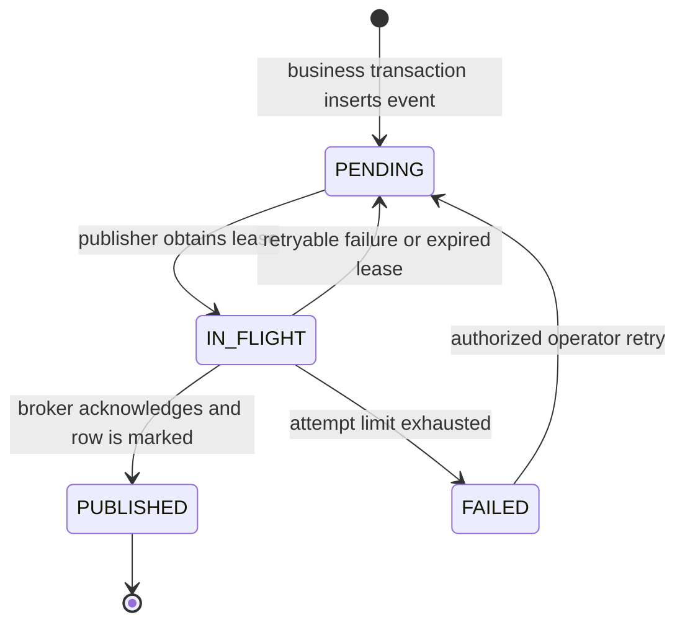
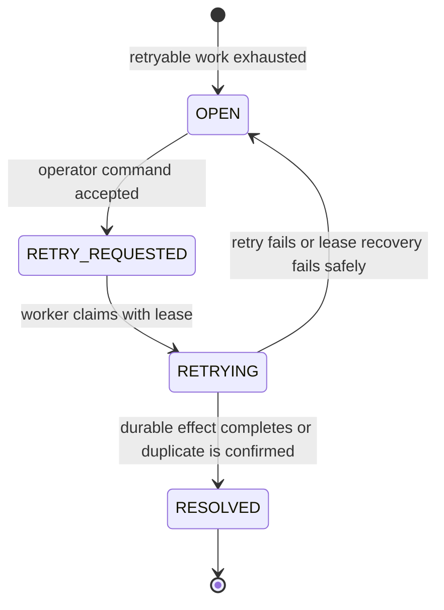

# LedgerFlow MVP Domain Model

- Status: Partially implemented
- Last updated: 2026-07-13

## Bounded modules

| Module | Owns | Exposes to other modules |
| --- | --- | --- |
| `orders` | Order aggregate, order HTTP idempotency, workflow coordination | Create/read order and guarded order transitions |
| `payments` | Payment aggregate, attempts, provider port and HTTP adapter | Start, reconcile, and finalize authorization/capture |
| `ledger` | Accounts, ledger transactions, entries, balance invariant | Post a payment-capture transaction idempotently |
| `messaging` | Transactional outbox and Kafka publisher | Append an event in the caller's transaction |
| `notifications` | Kafka inbox and notification records | Idempotent payment-captured event handling |
| `operations` | Sanitized failed-operation projection, retry requests, audit | Inspect failures and dispatch authorized retry commands |

The modules are packages in one deployable application. Cross-module calls use each module's `api` package. The successful capture finalization deliberately spans module APIs inside one local PostgreSQL transaction; no module reads another module's tables directly.

The `payments` module uses hexagonal architecture because it owns a non-trivial state machine and a replaceable external HTTP provider. Other modules use simpler package-by-feature structures unless their implementation evidence justifies additional ports.

## Ubiquitous language

- **Order:** The customer's request to pay one positive INR amount.
- **Payment:** The local lifecycle for authorizing and capturing the order amount.
- **Provider operation key:** A stable identifier for one logical authorization or capture, reused for provider retries and lookup.
- **Ledger transaction:** An immutable balanced group of entries representing one captured payment.
- **Ledger entry:** One debit or credit in integer minor units and one currency.
- **Outbox event:** A domain event stored in the same transaction as the business state it describes.
- **Inbox record:** Proof that a consumer has applied or is atomically applying one event ID.
- **Notification:** The durable record created after consuming a payment-captured event; delivery is outside MVP scope.
- **Failed operation:** A sanitized, operator-visible record for work that exhausted automatic recovery or reached a retryable uncertain state.
- **Retry request:** An idempotent, audited operator command to resume one failed operation.

## Value objects and identifiers

- Order IDs are PostgreSQL-generated UUIDv7 values. Other identifier strategies remain deferred. All IDs are opaque in APIs.
- `Money` is `{ amountMinor: long, currency: "INR" }`; `amountMinor` must be greater than zero.
- `CorrelationId` is 1–64 characters matching `[A-Za-z0-9._-]+`; invalid inbound values are replaced with a generated UUID.
- `Idempotency-Key` is 8–128 characters matching `[A-Za-z0-9._:-]+`. Only its SHA-256 hash is persisted.
- `RequestFingerprint` is SHA-256 over the normalized validated business request.
- Persisted timestamps are `Instant` values serialized in UTC. The current order timestamps are generated by PostgreSQL in the creation transaction.
- `EventId`, `OperationId`, and `RetryRequestId` are UUIDv4 values and are never reused.

## Order aggregate

The implemented order contains its UUIDv7 ID, owner subject, optional client reference, positive INR money, `CREATED` status, reserved optimistic version, initial correlation ID, and UTC timestamps. It has no payment association yet.

The active state machine is deliberately small:

| From | Command/result | To | Guard and effects |
| --- | --- | --- | --- |
| New | Accept order | `CREATED` | Unique scoped key; valid positive INR money; response snapshot commits atomically |

Payment-related order transitions below are proposed for later milestones and are not implemented:

| From | Command/result | To | Guard and effects |
| --- | --- | --- | --- |
| `CREATED` | Start payment | `PAYMENT_PROCESSING` | Requires a separately approved payment milestone |
| `PAYMENT_PROCESSING` | Capture finalization | `COMPLETED` | Payment becomes `CAPTURED`; balanced ledger and outbox commit atomically |
| `PAYMENT_PROCESSING` | Provider decline | `PAYMENT_DECLINED` | Payment is a decline state; no ledger or outbox |
| `PAYMENT_PROCESSING` | Retryable outcome exhausted | `PAYMENT_RETRY_PENDING` | Failed operation is open; no ledger or outbox |
| `PAYMENT_PROCESSING` | Non-retryable internal failure | `FAILED` | Failure is recorded and requires investigation |
| `PAYMENT_RETRY_PENDING` | Accepted retry request | `PAYMENT_PROCESSING` | Retry request is unique and operation is retryable |
| `PAYMENT_RETRY_PENDING` | Reconciliation proves non-retryable | `FAILED` | Safe failure evidence is recorded; no financial/event effect |

Terminal order states are immutable in the MVP. Refunds and corrective order transitions require a future design.

## Payment aggregate

A payment contains its ID, order ID, money, state, current resume stage, the restricted local/test provider payment-method reference needed for recovery, stable authorization and capture operation keys, sanitized provider result references, attempt counters, optimistic version, and timestamps. The payment-method reference is never exposed through responses, events, logs, traces, or operator views.

| State | Permitted next states | Required evidence |
| --- | --- | --- |
| `CREATED` | `AUTHORIZING` | Persisted stable authorization operation key |
| `AUTHORIZING` | `AUTHORIZED`, `DECLINED`, `AUTHORIZATION_RETRY_PENDING`, `AUTHORIZATION_UNKNOWN`, `FAILED` | Provider response or reconciled lookup result |
| `AUTHORIZATION_RETRY_PENDING` | `AUTHORIZING`, `FAILED` | Idempotent operator retry or non-retryable reconciliation result |
| `AUTHORIZATION_UNKNOWN` | `AUTHORIZING`, `FAILED` | Lookup/retry with the same provider operation key or non-retryable reconciliation result |
| `AUTHORIZED` | `CAPTURING` | Provider authorization reference exists |
| `CAPTURING` | `CAPTURED`, `CAPTURE_RETRY_PENDING`, `CAPTURE_UNKNOWN`, `FAILED` | Provider response or reconciled lookup result |
| `CAPTURE_RETRY_PENDING` | `CAPTURING`, `FAILED` | Idempotent operator retry or non-retryable reconciliation result |
| `CAPTURE_UNKNOWN` | `CAPTURING`, `FAILED` | Lookup/retry with the same provider operation key or non-retryable reconciliation result |
| `CAPTURED` | None | Provider capture reference, ledger transaction, and outbox event exist |
| `DECLINED`, `FAILED` | None | Sanitized terminal reason exists |

Every transition compares the persisted version and expected source state. Provider I/O happens after a committed transition to `AUTHORIZING` or `CAPTURING`, and its result is committed in a later transaction.

### Provider result classification

| Provider result | Classification | Behavior |
| --- | --- | --- |
| Success | Final success | Persist provider reference and continue |
| Decline | Final business outcome | Enter explicit decline state; never retry automatically |
| HTTP 429/5xx or connection failure | Temporary | Retry once using the same operation key, then open a failed operation |
| Read timeout or connection loss after send | Unknown | Query by operation key; resend only if lookup proves no provider effect |
| Malformed or contradictory response | Non-retryable | Enter `FAILED`, record sanitized evidence, alert operator |

## Ledger model

The MVP seeds two INR accounts:

- `PAYMENT_CLEARING`, an asset account debited when cash is captured; and
- `MERCHANT_PAYABLE`, a liability account credited for captured funds owed to the merchant.

One successful capture produces one immutable transaction:

| Account | Side | Amount |
| --- | --- | --- |
| `PAYMENT_CLEARING` | Debit | Order amount in INR minor units |
| `MERCHANT_PAYABLE` | Credit | Order amount in INR minor units |

Ledger invariants:

- a transaction contains exactly two MVP entries;
- each amount is positive and uses the transaction currency;
- total debits equal total credits per currency;
- account currency matches entry currency;
- `(source_type, source_id)` is unique, making capture posting idempotent;
- entries and transactions are immutable; corrections use new reversing transactions in a future milestone; and
- the database rechecks the aggregate balance at commit through a deferred constraint trigger.

## Outbox lifecycle

The publisher may send the same event more than once if it crashes after broker acknowledgement but before marking the row. It must never mark `PUBLISHED` before acknowledgement. Lease expiry makes abandoned work eligible again.

## Notification consumption

The `PaymentCaptured` handler validates the envelope, type, and version, computes a canonical payload hash, and then executes one PostgreSQL transaction:

1. insert the event ID and hash into the inbox, or read the existing row on conflict;
2. if the event ID exists with the same hash, treat delivery as successfully handled;
3. if the event ID exists with a different hash, roll back and raise a non-retryable integrity failure for direct DLT;
4. insert one notification with a unique event ID; and
5. commit before acknowledging the Kafka offset.

Transient failures are retried through Kafka retry topics. Invalid type/version/integrity input goes directly to DLT; repeatedly failing transient input reaches it after the bounded retries. Replaying the same valid event ID remains safe because of the inbox hash and notification unique constraints.

## Failed-operation lifecycle

Only `OPEN` retryable operations accept retry commands. A unique retry idempotency scope, single-active-retry constraint, and worker lease prevent duplicate scheduling or execution. Payment resolves after reconciled provider/local state commits; outbox resolves after its row is durably `PUBLISHED`; notification replay resolves only after the notification transaction commits or confirms an identical prior effect. Operation history is append-audited even when its current status changes.

## Transaction boundaries and crash recovery

Only the first row is implemented. Remaining boundaries are planned for later milestones.

| Boundary | Atomic work | Important crash behavior |
| --- | --- | --- |
| Accept order | Idempotency claim, `CREATED` order, immutable `201` snapshot | All commit or roll back; unique key prevents a second order |
| Start provider stage | Guarded payment/order transition and attempt | Recovery sees durable work before external call |
| Record decline/retry pending | Payment, order, failed operation, cached HTTP result | Replay returns the same outcome |
| Finalize capture | Payment `CAPTURED`, order `COMPLETED`, ledger transaction/entries, outbox, cached HTTP result | All local effects commit or roll back together |
| Publish outbox | Lease claim, then broker send, then published marker | Duplicate publication is possible; event loss is not accepted |
| Consume event | Inbox and notification | Duplicate delivery is a successful no-op |
| Accept operator retry | Retry request, operation status, audit | Duplicate command does not schedule duplicate work |

Provider capture and PostgreSQL cannot be one transaction. If capture succeeds but local finalization fails, recovery looks up the stable capture operation key, confirms the provider outcome, and retries the idempotent finalization transaction.

## Domain events

The MVP emits event type `com.ledgerflow.payment.captured` with event version `1` after local capture finalization. Its data contains only:

- order ID;
- payment ID;
- ledger transaction ID;
- amount minor and currency; and
- capture timestamp.

Payment method tokens, idempotency keys, raw provider responses, JWTs, and error stack traces never appear in events.
