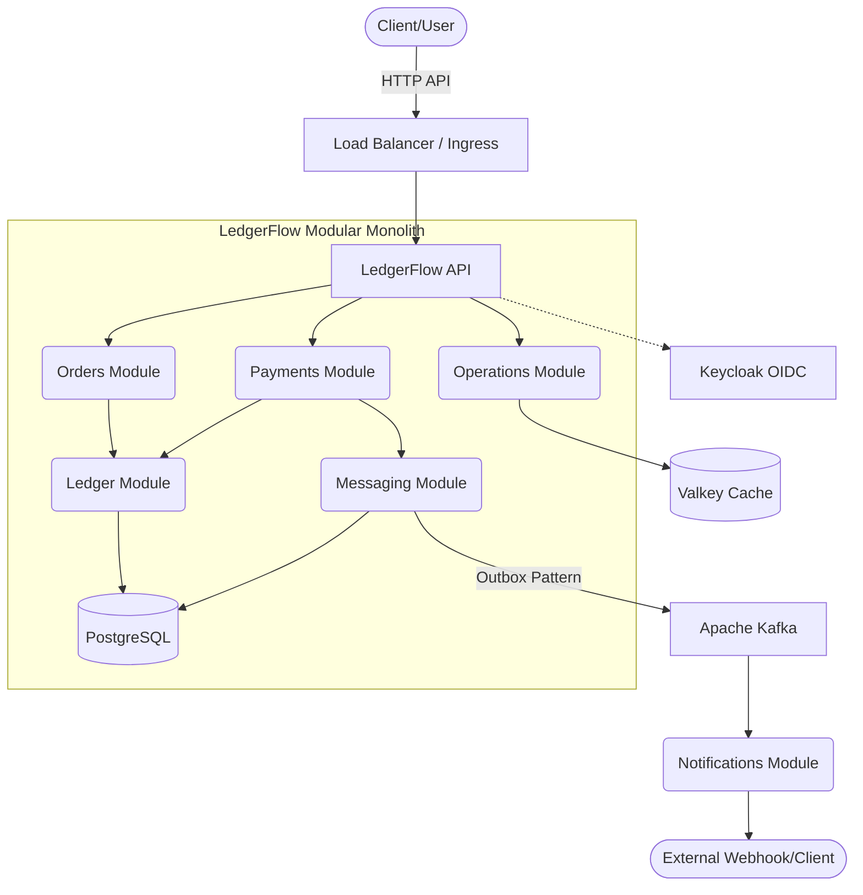
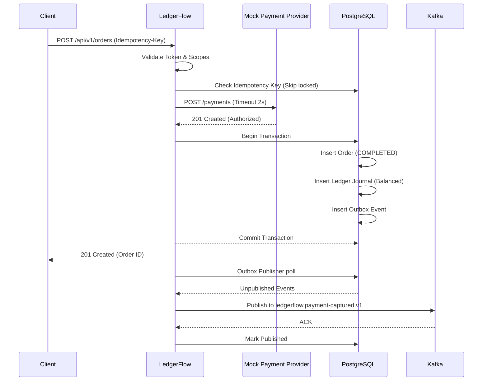

# Architecture Diagrams

## High-Level System Architecture

```mermaid
flowchart TD
    User([Client/User]) -->|HTTP API| LB[Load Balancer / Ingress]
    LB --> API[LedgerFlow API]
    
    subgraph LedgerFlow Modular Monolith
        API --> Orders(Orders Module)
        API --> Payments(Payments Module)
        API --> Ops(Operations Module)
        Orders --> Ledger(Ledger Module)
        Payments --> Ledger
        Payments --> Messaging(Messaging Module)
        Ledger --> DB[(PostgreSQL)]
        Messaging --> DB
    end
    
    Messaging -->|Outbox Pattern| Kafka[Apache Kafka]
    Kafka --> Notifications(Notifications Module)
    Notifications --> ExternalWebhook([External Webhook/Client])
    
    Ops --> Caching[(Valkey Cache)]
    API -.-> IDP[Keycloak OIDC]
```

## Order Creation Workflow

```mermaid
sequenceDiagram
    participant C as Client
    participant API as LedgerFlow
    participant P as Mock Payment Provider
    participant DB as PostgreSQL
    participant K as Kafka
    
    C->>API: POST /api/v1/orders (Idempotency-Key)
    API->>API: Validate Token & Scopes
    API->>DB: Check Idempotency Key (Skip locked)
    API->>P: POST /payments (Timeout 2s)
    P-->>API: 201 Created (Authorized)
    
    API->>DB: Begin Transaction
    DB->>DB: Insert Order (COMPLETED)
    DB->>DB: Insert Ledger Journal (Balanced)
    DB->>DB: Insert Outbox Event
    API-->>DB: Commit Transaction
    
    API-->>C: 201 Created (Order ID)
    
    %% Async publishing
    API->>DB: Outbox Publisher poll
    DB-->>API: Unpublished Events
    API->>K: Publish to ledgerflow.payment-captured.v1
    K-->>API: ACK
    API->>DB: Mark Published
```
