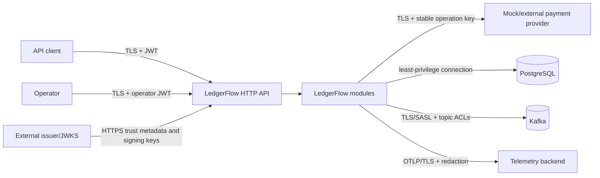

# LedgerFlow MVP Threat Model

- Status: Partially implemented
- Last updated: 2026-07-13
- Method: asset and trust-boundary review informed by STRIDE and OWASP API Security Top 10

## Scope

This threat model covers the MVP public API, operator API, modular-monolith process, mock payment-provider boundary, PostgreSQL, Kafka topics, OpenTelemetry export, and administrative retry flow.

The active scope includes the Create Order HTTP/PostgreSQL boundary and the non-public payment/provider integration harness. Implemented payment controls include explicit state guards, stable independent provider request IDs, optimistic locking, short database transactions, append-only attempt history, bounded retry classification, explicit HTTP timeouts, and lookup-first recovery. Ledger, Kafka, notification, and operator controls below are launch requirements for future milestones, not claims about current behavior.

It does not certify PCI DSS compliance or cover a real payment provider, identity-provider implementation, host/container hardening, Kafka/PostgreSQL control planes, or internet-scale denial-of-service protection.

## Security objectives

- Only an authenticated owner can create and read its orders.
- Only explicitly authorized operators can inspect failures or request retries.
- A replay, race, duplicate Kafka delivery, or operator double-submit cannot create duplicate financial effects.
- Ledger balance and immutability survive application defects and concurrent requests.
- Payment tokens, bearer tokens, idempotency keys, secrets, and raw provider payloads do not leak through logs, traces, events, errors, or operator APIs.
- Compromise or failure of the mock/external provider cannot cause LedgerFlow to trust an invalid state transition.
- Every privileged mutation and financial transition is attributable through durable audit or domain history, correlation, and trace context. Privileged reads are attributable through protected access logs.

## Assets and data classification

| Asset | Classification | Protection goal |
| --- | --- | --- |
| JWTs, DB/Kafka/provider/OTLP credentials | Secret | Never persist in business tables, logs, traces, or source |
| Mock payment-method reference | Internal test control, not a real credential | Persist only until authorization resolves; never log/event/trace; reject PAN |
| Idempotency key | Sensitive client nonce, not an authentication secret | Hash for data minimization; never log or return; recommend at least 128 bits of entropy |
| Order ownership and amount | Confidential business data | Owner authorization and minimal operator failure projection |
| Ledger and payment state | High-integrity financial data | Atomicity, constraints, audit, no direct mutation |
| Kafka events and DLT records | Internal confidential | Topic ACLs, encryption, schema validation, bounded retention |
| Correlation ID, trace ID, resource IDs | Internal operational metadata | Validate, avoid treating as authorization, bounded retention |
| Operator reason and audit | Confidential audit data | Append-only history and restricted access |

## Trust boundaries

The client, operator, provider, Kafka records, and trace headers are untrusted inputs. PostgreSQL is authoritative but can contain stale or contradictory data after defects; state guards and constraints still validate it.

## Threats and mitigations

| ID | Threat | Impact | Required mitigations | Verification |
| --- | --- | --- | --- | --- |
| T-01 | Forged, expired, wrong-issuer, wrong-audience, or algorithm-confused JWT | Unauthorized order or operator access | RS256-only signature policy, exact issuer/audience, expiry/not-before validation, bounded JWKS retrieval/cache, fail-closed readiness | Invalid-claim/algorithm, key-rotation, and issuer-outage tests |
| T-02 | Broken object-level authorization by changing `orderId` | Customer reads another customer's order | Compare JWT `sub` with persisted owner; return indistinguishable `404` | Two-subject ownership tests |
| T-03 | Customer calls operator endpoint or operator retries without retry scope | Privilege escalation and duplicate money movement | Separate read/retry scopes; method-level authorization; deny by default | Scope matrix tests |
| T-04 | Idempotency-key replay with changed payload | Wrong order returned or duplicate charge | Principal/operation scope, normalized request hash, unique DB key, `409` mismatch | Sequential and concurrent mismatch tests |
| T-05 | Guessing or leaking idempotency keys | Replay intelligence or cross-client collision | 8–128 bounded ASCII values, client guidance for ≥128-bit entropy, SHA-256 data minimization, no logging, owner/operation scope | Log/DB inspection and cross-scope tests |
| T-06 | Concurrent requests race state transitions | Double authorization, capture, ledger, or outbox | Stable provider keys, optimistic versions, unique business references, guarded SQL | Concurrency and stale-version tests |
| T-07 | Provider timeout hides a successful operation | Duplicate provider effect or missing local capture | Query by stable operation key before resend; idempotent provider contract; durable pre-call state | Timeout/crash-window tests |
| T-08 | Malicious or compromised provider sends impossible data | Invalid payment state committed | Strict response outcome/reference validation, state guard, bounded body, sanitized failure | Invalid/contradictory-response tests; amount echo validation remains a real-provider requirement |
| T-09 | SSRF through configurable provider URL | Access to internal services/metadata | Provider base URI comes only from trusted deployment config, must be absolute HTTP(S), and is never request-supplied; production egress allowlisting is required | Configuration tests, deployment policy, and review |
| T-10 | SQL injection or mass assignment | Data compromise | Parameterized JDBC, typed commands, explicit field mapping, reject unknown JSON properties | Static analysis and hostile input tests |
| T-11 | Unbalanced or mutable ledger data | Financial integrity loss | Positive integer checks, currency checks, deferred balance trigger, immutable rows, least-privilege DB role | Direct SQL constraint tests |
| T-12 | Outbox/Kafka duplicate or reordered records | Duplicate notification or inconsistent projection | Unique event ID, order key, inbox idempotency, one event type per order in MVP | Duplicate/reorder tests |
| T-13 | Spoofed or malformed Kafka event | Unauthorized notification or consumer crash | Broker TLS/SASL, topic ACLs, schema/type/version validation, bounded sizes, DLT | Invalid-schema and unauthorized-topic tests |
| T-14 | Repeated transient event failure causes infinite retry or partition starvation | Availability loss | Three non-blocking retries, bounded backoff, DLT, per-record handling; invalid input goes directly to DLT | Retry-count and healthy-neighbor tests |
| T-15 | DLT/operator retry is abused | Repeated workload or financial effects | Operator retry scope, bounded pagination/concurrency, reason, idempotency, worker lease, current-state guard, audit | Concurrent command/worker and stale-lease tests |
| T-16 | Sensitive values leak through logs/traces/events/errors | Credential or privacy breach | Attribute allowlist, redaction, no bodies/tokens/keys, stable safe error codes; stack traces only in access-restricted redacted server error logs | Capture exporters/logs and scan values |
| T-17 | Untrusted correlation/trace headers cause log injection or oversized metadata | Log corruption or resource exhaustion | Validate correlation format/length; standards-compliant trace parser; replace invalid values | Fuzz boundary headers |
| T-18 | Large bodies, slow provider, or high-cardinality metrics exhaust resources | Denial of service/cost | Implemented 16 KiB provider-response limit and connect/request timeouts; bounded pools/queues/concurrency, deployment-edge rate limits, and metric-label policy remain launch controls | Slow/timeout tests now; load and resource-bound tests before launch |
| T-19 | Secrets committed or insecure defaults enabled in production | Infrastructure compromise | Environment/secret manager, secret scanning, local-only mock profile, production startup guard | CI scanning and profile tests |
| T-20 | Operator sees raw stack trace, provider response, or event secret | Internal information disclosure | Sanitized failure projection and allowlisted retry payload; restricted audit API | Serialization snapshot tests |

## Authentication and authorization design

- LedgerFlow acts as an OAuth 2.0 JWT resource server; it does not issue tokens.
- Production validates an exact configured issuer, audience `ledgerflow-api`, RS256 signatures only, `exp`, and `nbf`. JWKS retrieval uses HTTPS with bounded connect/read timeouts and cache lifetime; readiness remains false until initial trusted keys load, and validation fails closed when no valid cached key exists.
- JWT `sub` is the owner scope for order creation and reads.
- The active order scopes map to the authorities documented in `docs/api-design.md`; operator scopes remain proposed.
- Local/test uses ephemeral test signing keys or a test identity container and exercises key rotation. No authentication bypass exists in the main artifact.
- Actuator and mock-provider control endpoints are not exposed on the public API. Mock service code is a separate integration-test fixture and is absent from the production artifact. The payment workflow has no public route, and a real provider must be approved before that changes.

## Input and external-service safety

- Bean validation is not the only boundary: normalized commands, state guards, and database constraints revalidate critical invariants.
- The active public API rejects unknown fields and has no payment-method field. The non-public integration harness accepts only opaque `pm_mock_*` references; no PAN or real credential is accepted.
- The mock payment-method reference is persisted only while authorization may need recovery, then cleared after success or a terminal authorization result. It is never returned or copied to attempt history. A real provider requires a new token-vault/envelope-encryption decision, restricted database privileges, and threat review.
- Provider host and timeout configuration are deployment input, never client input. The current adapter accepts HTTP for loopback integration tests; production TLS validation, egress allowlisting, credentials, and host policy require the real-provider milestone.
- Provider errors are mapped to allowlisted classifications. Raw response bodies and headers are discarded after extracting validated fields.
- Retry policies distinguish declines, temporary failures, and unknown outcomes; no blanket retry interceptor wraps provider calls.

## Kafka and outbox safety

- Production Kafka uses TLS/SASL and distinct least-privilege principals for main publishing, notification consumption, retry/DLT publishing, and DLT inspection where the platform permits.
- Topic auto-creation is disabled outside local/test. Deployment validates topic existence, partitions, retention, maximum message size, and ACLs.
- The producer waits for `acks=all`; idempotent producer mode reduces broker-level duplicates but does not replace outbox/inbox idempotency.
- DLT publication must be confirmed before the source offset is committed. If recovery publication fails, the source record remains eligible for redelivery.
- Exception headers are bounded and sanitized; stack traces are not copied into DLT headers or the failure projection.
- A malformed DLT record stores only bounded size/hash and safe parse metadata in PostgreSQL; raw poison bytes remain access-controlled by Kafka retention and are not exposed through the operator API.

## Telemetry safety

- W3C trace context propagates across HTTP and Kafka. Invalid trace context starts a new trace.
- Correlation ID is propagated separately in `X-Correlation-Id` and `x-correlation-id` Kafka headers.
- Span and log attributes may include operation type, stable failure code, event type, topic, and internal resource IDs.
- Span attributes/events must not include JWTs, payment references, idempotency keys, request/response bodies, provider bodies, SQL parameters, operator reasons, full Kafka payloads, or stack traces. Protected structured server error logs may contain a redacted internal stack trace under restricted access and retention.
- High-cardinality identifiers are not metric labels. Telemetry export failure never fails the business transaction.
- Sampling must preserve error traces at an operationally useful rate without trusting client sampling flags as authorization.

## Operator controls and audit

- Operator endpoints require HTTPS and explicit scopes; deployment should additionally restrict network access.
- List endpoints are paginated, filtered, and bounded. Deployment-edge rate limits are required before internet exposure. Failure details are safe projections rather than raw tables.
- Retry commands require a 10–500 character reason and idempotency key.
- Retry dispatch rechecks operation status, retryability, and current domain state inside the acceptance transaction.
- An append-only audit records operator subject, mutation, reason, resource, before/after status, original and retry correlation IDs, trace ID, and timestamp. Protected access logs cover operator reads.
- Operators cannot directly change payment or ledger state, edit Kafka offsets, or mutate outbox/inbox rows through the API.

## Security test strategy

- JWT signature, issuer, audience, expiry, not-before, missing scope, and scope-combination tests.
- JWT algorithm-confusion, signing-key rotation, initial JWKS outage, and expired-cache failure tests.
- Owner-versus-other-owner object authorization tests using indistinguishable `404` responses.
- Header/body boundary and malformed JSON fuzz tests.
- Concurrent idempotency and operator-retry tests.
- Multi-instance retry-worker claim, expired-lease takeover, and stale-worker completion-rejection tests.
- Provider contract tests for malformed IDs, wrong amount/currency, oversized body, timeout, and unknown outcome.
- Direct PostgreSQL tests proving balance, immutability, unique source, and state constraints.
- Database-role tests proving the runtime user cannot perform DDL or update/delete immutable ledger/audit rows while Flyway can migrate.
- Kafka tests for malformed event, unknown version, duplicate delivery, poison record, retry exhaustion, and DLT publication failure.
- DLT-catalog PostgreSQL outage tests proving no offset commit, idempotent redelivery, alerting, and no recursive DLT.
- Captured structured-log, in-memory trace-exporter, outbox-header, and DLT-record assertions that seeded secret markers never appear.
- Production-profile startup tests proving no mock service or permissive authentication can be enabled before a public payment route exists.

## Residual risks and launch conditions

- Rate limiting and volumetric DDoS protection depend partly on the deployment edge and must be selected before internet exposure.
- A real payment provider requires a new threat review, token-storage decision, provider-specific reconciliation, and PCI assessment.
- Data retention for idempotency, audit, outbox, inbox, notification, DLT, logs, and traces must be approved before production launch.
- Backup/restore, disaster recovery, key rotation, vulnerability management, and broker/database hardening require deployment runbooks outside this MVP implementation plan.

## References

- [OWASP API Security Top 10 2023](https://owasp.org/API-Security/editions/2023/en/0x11-t10/)
- [Spring Security OAuth 2.0 Resource Server JWT](https://docs.spring.io/spring-security/reference/servlet/oauth2/resource-server/jwt.html)
- [W3C Trace Context](https://www.w3.org/TR/trace-context/)
