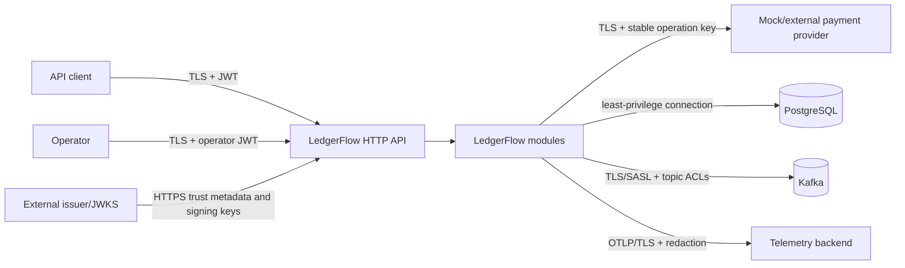

# LedgerFlow MVP Threat Model

- Status: Partially implemented
- Last updated: 2026-07-15
- Method: asset and trust-boundary review informed by STRIDE and OWASP API Security Top 10

## Scope

This threat model covers the MVP public API, operator API, modular-monolith process, mock payment-provider boundary, PostgreSQL, Kafka topics, OpenTelemetry export, and administrative retry flow.

The active scope includes the Create Order HTTP/PostgreSQL boundary, the non-public payment/provider integration harness, non-public capture accounting, the transactional outbox publisher, notification consumer/inbox, DLT catalog, terminal malformed-DLT evidence, isolated management listener, and audited replay CLI. Capture accounting commits payment `CAPTURE_ACCOUNTED`, the balanced journal, and outbox event together. Kafka publish/consume is at least once; event-ID/hash transport checks plus a versioned semantic-effect constraint prevent the covered capture notification from repeating under a new envelope. Public financial orchestration, order `COMPLETED`, payment `CAPTURED`, and the operator HTTP controls below remain launch requirements, not claims about current behavior.

It does not certify PCI DSS compliance or cover a real payment provider, identity-provider implementation, host/container hardening, Kafka/PostgreSQL control planes, or internet-scale denial-of-service protection.

## Security objectives

- Only an authenticated owner can create and read its orders.
- Only explicitly authorized operators can inspect failures or request retries.
- A replay, race, duplicate Kafka delivery, or operator double-submit cannot create duplicate financial effects.
- Ledger balance and immutability survive application defects and concurrent requests.
- Payment tokens, bearer tokens, idempotency keys, secrets, and raw provider payloads do not leak through logs, traces, events, errors, or operator APIs.
- Compromise or failure of the mock/external provider cannot cause LedgerFlow to trust an invalid state transition.
- Every privileged mutation and financial transition is attributable through durable audit or domain history, correlation, and trace context. Privileged reads are attributable through protected access logs.

## Assets and data classification

| Asset | Classification | Protection goal |
| --- | --- | --- |
| JWTs, DB/Kafka/provider/OTLP credentials | Secret | Never persist in business tables, logs, traces, or source |
| Mock payment-method reference | Internal test control, not a real credential | Persist only until authorization resolves; never log/event/trace; reject PAN |
| Idempotency key | Sensitive client nonce, not an authentication secret | Hash for data minimization; never log or return; recommend at least 128 bits of entropy |
| Order ownership and amount | Confidential business data | Owner authorization and minimal operator failure projection |
| Ledger and payment state | High-integrity financial data | Atomicity, constraints, audit, no direct mutation |
| Kafka events and DLT records | Internal confidential | Topic ACLs, encryption, schema validation, bounded retention |
| Correlation ID, trace ID, resource IDs | Internal operational metadata | Validate, avoid treating as authorization, bounded retention |
| Operator reason and audit | Confidential audit data | Append-only history and restricted access |

## Trust boundaries

The client, operator, provider, Kafka records, and trace headers are untrusted inputs. PostgreSQL is authoritative but can contain stale or contradictory data after defects; state guards and constraints still validate it.

## Threats and mitigations

| ID | Threat | Impact | Required mitigations | Verification |
| --- | --- | --- | --- | --- |
| T-01 | Forged, expired, wrong-issuer, wrong-audience, or algorithm-confused JWT | Unauthorized order or operator access | RS256-only signature policy, exact issuer/audience, expiry/not-before validation, deny by default | Signed-token wrong-signature/issuer/audience/expiry and authority tests; bounded JWKS transport/key-rotation exercises remain launch work |
| T-02 | Broken object-level authorization by changing `orderId` | Customer reads another customer's order | Compare JWT `sub` with persisted owner; return indistinguishable `404` | Two-subject ownership tests |
| T-03 | Customer calls operator endpoint or operator retries without retry scope | Privilege escalation and duplicate money movement | Reserved operator route policy requires separate read/retry scopes plus operator/admin role; deny by default; future handlers repeat use-case authorization | Negative role/scope route tests now; operator use-case matrix when endpoints exist |
| T-04 | Idempotency-key replay with changed payload | Wrong order returned or duplicate charge | Principal/operation scope, normalized request hash, unique DB key, `409` mismatch | Sequential and concurrent mismatch tests |
| T-05 | Guessing or leaking idempotency keys | Replay intelligence or cross-client collision | 8–128 bounded ASCII values, client guidance for ≥128-bit entropy, SHA-256 data minimization, no logging, owner/operation scope | Log/DB inspection and cross-scope tests |
| T-06 | Concurrent requests race state transitions | Double authorization, capture, ledger, or outbox | Stable provider keys, optimistic versions, unique business references, guarded SQL | Concurrency and stale-version tests |
| T-07 | Provider timeout hides a successful operation | Duplicate provider effect or missing local capture | Query by stable operation key before resend; idempotent provider contract; durable pre-call state | Timeout/crash-window tests |
| T-08 | Malicious or compromised provider sends impossible data | Invalid payment state committed | Strict response outcome/reference validation, state guard, bounded body, sanitized failure | Invalid/contradictory-response tests; amount echo validation remains a real-provider requirement |
| T-09 | SSRF through configurable provider URL | Access to internal services/metadata | Provider base URI comes only from trusted deployment config, must be absolute HTTP(S), and is never request-supplied; production egress allowlisting is required | Configuration tests, deployment policy, and review |
| T-10 | SQL injection or mass assignment | Data compromise | Parameterized JDBC, typed commands, explicit field mapping, reject unknown JSON properties | Static analysis and hostile input tests |
| T-11 | Unbalanced or mutable ledger data | Financial integrity loss | Positive integer checks, currency checks, deferred balance trigger, immutable rows, least-privilege DB role | Direct SQL constraint tests |
| T-12 | Duplicate, reordered, or re-enveloped Kafka record | Duplicate notification or inconsistent projection | Event-ID/hash transport idempotency, order key, database-unique versioned semantic effect based on capture ledger identity, content conflict detection | Redelivery, re-enveloping, conflict, and concurrent-insert tests |
| T-13 | Spoofed or malformed Kafka event | Unauthorized notification, consumer crash, or permanent DLT partition blockage | Broker TLS/SASL, least-privilege topic ACLs, schema/type/version validation, bounded sizes, acknowledged DLT, terminal evidence by actual DLT coordinates | Invalid-schema, semantic-conflict, malformed-route, persistence-outage, and partition-progress tests |
| T-14 | Repeated transient event failure causes infinite retry or partition starvation | Availability loss | Three bounded pause-based retries after the initial attempt, bounded poll intake/concurrency, then acknowledged DLT publication; terminal DLT data advances only after durable sanitized evidence | Retry-count, pause/backpressure, DLT acknowledgement, evidence-store outage/recovery, and later-record progress tests |
| T-15 | DLT replay is abused | Repeated workload or notification effects | Narrow CLI, validated replayable catalog entry, required actor/reason, generated transport correlation/trace, owner lease, immutable audit, inbox deduplication; future HTTP scope controls | Replay validation, stale-lease, audit, and duplicate-delivery tests |
| T-16 | Sensitive values leak through logs/traces/events/errors | Credential or privacy breach | Attribute allowlist, redaction, no bodies/tokens/keys, stable safe error codes; reject payment/card-like public fields; stack traces only in access-restricted redacted server error logs | Captured HTTP/log marker tests plus existing event/trace tests |
| T-17 | Untrusted correlation/trace headers cause log injection or oversized metadata | Log corruption or resource exhaustion | Validate correlation format/length; standards-compliant trace parser; replace invalid values | Fuzz boundary headers |
| T-18 | Large bodies, request/probe floods, slow provider, or high-cardinality metrics exhaust resources | Denial of service/cost | 16 KiB request/provider-response limits, strict JSON/header bounds, bounded per-instance subject rate state, separate non-public management port, coalesced readiness cache, managed Kafka probe client, provider deadlines/bulkhead/circuit, bounded Kafka intake, and graceful drain; deployment-edge aggregate limits remain required | Request-limit/rate tests, 100-caller probe coalescing, management-port HTTP tests, Toxiproxy latency/reset/timeout, circuit/bulkhead, bounded retry, and shutdown tests; load test before launch |
| T-19 | Secrets committed, vulnerable dependencies/images, or insecure defaults enabled in production | Infrastructure or supply-chain compromise | Environment/secret manager, version-and-digest-pinned Trivy scan, local-only mock profile, production startup guard, and exact expiring image exceptions that are prohibited outside local development | Repository/artifact/all-Compose-image scan, exception-policy validation, and profile tests |
| T-20 | Operator sees raw stack trace, provider response, or event secret | Internal information disclosure | Sanitized failure projection and allowlisted retry payload; restricted audit API | Serialization snapshot tests |

## Authentication and authorization design

- LedgerFlow acts as an OAuth 2.0 JWT resource server; it does not issue tokens.
- Production validates an exact configured issuer, audience `ledgerflow-api`, RS256 signatures only, `exp`, and `nbf`. The application fails closed when signature keys or valid claims are unavailable. Production must use an HTTPS issuer/JWKS endpoint; explicit JWKS transport budgets, rotation exercises, and issuer-outage readiness policy remain launch work.
- JWT `sub` is the owner scope for order creation and reads.
- Standard scopes map to `SCOPE_` authorities. Only `customer`, `operator`, and `admin` are accepted from Keycloak `realm_access.roles`; unrecognized or malformed roles add no authority. Active order routes require their route scope plus `customer` or `admin`.
- The reserved operator path requires `ledgerflow.operations.read` for GET or `ledgerflow.operations.retry` for other methods plus `operator` or `admin`. No operator handler or business action exists yet.
- Integration tests use ephemeral signing keys, and the local Keycloak realm defines roles/scopes/audience without users or credentials. No authentication bypass exists in the main artifact.
- Actuator uses a separate management listener. The application port serves no Actuator path; the management context exposes status-only liveness/readiness and Prometheus, with aggregate details disabled. `docs/deployment-security.md` requires deny-by-default network isolation and prohibits public management ingress. Mock service code is a separate integration-test fixture and is absent from the production artifact.

## Input and external-service safety

- Bean validation is not the only boundary: normalized commands, state guards, and database constraints revalidate critical invariants.
- The active public API accepts only JSON, rejects query parameters and compressed create bodies, and bounds headers, body bytes, nesting, tokens, names, strings, and numbers. Duplicate and unknown fields—including payment/card-like fields—are rejected before a business write. The non-public integration harness accepts only opaque `pm_mock_*` references; no PAN, CVV, or real credential is accepted.
- Create Order has a bounded per-instance fixed-window limiter keyed by a SHA-256 hash of authenticated subject. Raw identity/token/key material is not stored in limiter state. Global and unauthenticated attack control remains the responsibility of a trusted deployment ingress.
- The mock payment-method reference is persisted only while authorization may need recovery, then cleared after success or a terminal authorization result. It is never returned or copied to attempt history. A real provider requires a new token-vault/envelope-encryption decision, restricted database privileges, and threat review.
- Provider host and timeout configuration are deployment input, never client input. The current adapter accepts HTTP for loopback integration tests; production TLS validation, egress allowlisting, credentials, and host policy require the real-provider milestone.
- Provider errors are mapped to allowlisted classifications. Raw response bodies and headers are discarded after extracting validated fields.
- Retry policies distinguish declines, temporary failures, and unknown outcomes; no blanket retry interceptor wraps provider calls.
- Confirmed declines count as provider-availability success. Only temporary/unknown/invalid availability outcomes open the provider circuit; excess concurrent calls are rejected without an unbounded queue.
- Fault injection is compiled into the application only as an inert hook, is configurable only under local/test profiles, has an allowlist and delay cap, and is rejected at production startup when enabled.

## Kafka and outbox safety

- Capture accounting appends the outbox event through `messaging.api` in the same PostgreSQL transaction as payment `CAPTURE_ACCOUNTED` and the ledger journal. It does not mutate the order or claim final payment `CAPTURED`.
- The publisher claims with `SELECT ... FOR UPDATE SKIP LOCKED` in short transactions, publishes outside PostgreSQL, and uses owner-guarded acknowledgement/failure markers. Ten attempts use bounded exponential backoff and jitter.
- Production Kafka uses TLS/SASL and distinct least-privilege principals for main publishing, notification consumption, retry/DLT publishing, and DLT inspection where the platform permits.
- Topic auto-creation is disabled outside local/test. Deployment validates topic existence, partitions, retention, maximum message size, and ACLs.
- The producer waits for `acks=all`; idempotent producer mode reduces broker-level duplicates but does not replace outbox/inbox idempotency.
- Event ID plus canonical hash protects transport redelivery. A separate versioned capture-notification identity uses the immutable ledger transaction ID and compared business content, so re-enveloping cannot repeat the effect and conflicting content fails closed. Neither control replaces authenticated producers or least-privilege ACLs.
- DLT publication must be confirmed before the source offset is committed. If recovery publication fails, the source record remains eligible for redelivery.
- Exception headers are bounded and sanitized; stack traces are not copied into DLT headers or the failure projection.
- Missing/malformed original-routing headers and terminal invalid DLT data store only bounded hashes, sizes, allowlisted headers, stable classification, and actual DLT coordinates in immutable PostgreSQL evidence. Raw poison bytes remain access-controlled by Kafka retention. The DLT offset advances only after evidence commits; transient database failure retains it for idempotent redelivery.
- Audited replay preserves the validated canonical envelope and order-ID key, strips old exception/delivery metadata, and injects new transport correlation and W3C trace context. Direct row edits, offset changes, and ad hoc Kafka resends are prohibited.

## Ledger integrity and audit safety

- Only a provider-confirmed payment can enter the accounting transaction. The transaction locks that payment, inserts its complete balanced journal, changes the payment to `CAPTURE_ACCOUNTED`, and appends the outbox event; a failed deferred check or outbox append rolls back every effect.
- Concurrent and repeated requests converge on the same journal because the payment row serializes writers and PostgreSQL independently enforces unique capture source/payment keys.
- Domain code rejects fewer than two entries, mixed currencies, non-positive amounts, overflow, and unequal totals before SQL. PostgreSQL rechecks row and aggregate invariants at commit and verifies the capture's exact accounts, amount, payment, and order.
- Posted transaction and entry rows reject update/delete. Corrections append an exact linked reversal and retain the original evidence.
- Correlation ID, actor, source, and posting timestamp are required, bounded, and stored on each journal transaction. They are audit metadata, not authorization decisions.
- The current ledger use case is module-internal. Until an authenticated coordinator/operator boundary exists, its `actor` value must be supplied only by trusted application code and must not be exposed as a client-controlled field.
- Local and integration environments use a schema-owner credential for convenience. Production launch requires a separate non-owner runtime role that cannot disable triggers, run DDL, or mutate immutable rows; owner compromise remains outside application-level protection.

## Telemetry safety

- W3C trace context propagates across HTTP and Kafka. Invalid trace context starts a new trace.
- Correlation ID is propagated separately in `X-Correlation-Id` and `x-correlation-id` Kafka headers.
- Span and log attributes may include operation type, stable failure code, event type, topic, and internal resource IDs.
- Span attributes/events must not include JWTs, payment references, idempotency keys, request/response bodies, provider bodies, SQL parameters, operator reasons, full Kafka payloads, or stack traces. Protected structured server error logs may contain a redacted internal stack trace under restricted access and retention.
- High-cardinality identifiers are not metric labels. Telemetry export failure never fails the business transaction.
- Sampling must preserve error traces at an operationally useful rate without trusting client sampling flags as authorization.

## Replay controls and future operator API

- The implemented `scripts/replay-dead-letter` interface targets one replayable catalog UUID and requires an actor and a 10–500 character reason. It generates a new transport correlation/trace; its leased claim and owner-guarded result updates append immutable replay audit rows.
- The tool cannot replay malformed/non-replayable records, alter the canonical envelope/key, edit offsets, or mutate financial state. `REPLAYED` proves broker acknowledgement only.
- PostgreSQL rejects update and delete of replay audit evidence. Tests exercise both operations directly; production role separation must additionally prevent trigger or DDL bypass.

The following controls apply to the future operator HTTP workflow and are not implemented by the CLI:

- Operator endpoints require HTTPS and explicit scopes; deployment should additionally restrict network access.
- List endpoints are paginated, filtered, and bounded. Deployment-edge rate limits are required before internet exposure. Failure details are safe projections rather than raw tables.
- Retry commands require a 10–500 character reason and idempotency key.
- Retry dispatch rechecks operation status, retryability, and current domain state inside the acceptance transaction.
- An append-only audit records operator subject, mutation, reason, resource, before/after status, original and retry correlation IDs, trace ID, and timestamp. Protected access logs cover operator reads.
- Operators cannot directly change payment or ledger state, edit Kafka offsets, or mutate outbox/inbox rows through the future API.

## Security test strategy

- Signed JWT signature, issuer, audience, expiry, missing scope, and allowlisted-role tests.
- Malformed/unapproved realm-role conversion and reserved operator-boundary negative tests. Algorithm-confusion, key-rotation, and issuer/JWKS outage exercises remain production-launch tests.
- Owner-versus-other-owner object authorization tests using indistinguishable `404` responses.
- Query, media/content encoding, duplicate/unknown JSON, header/body size, rate-limit, and malformed JSON boundary tests.
- Concurrent HTTP idempotency tests; operator-HTTP retry tests remain future.
- Multi-instance outbox/replay claims, expired-lease takeover, and stale-owner completion-rejection tests.
- Provider contract tests for malformed IDs, wrong amount/currency, oversized body, timeout, and unknown outcome.
- Direct PostgreSQL tests proving balance, immutability, unique source, and state constraints.
- Concurrent ledger-posting tests proving one payment produces one journal and one payment accounting transition.
- Database-role tests proving the runtime user cannot perform DDL or update/delete immutable ledger/audit rows while Flyway can migrate.
- Kafka tests for malformed event, unknown version, duplicate delivery, re-enveloping and semantic conflicts, the publish/marker crash window, poison records, retry exhaustion, malformed DLT routing, terminal-evidence persistence failure/recovery, and partition progress.
- Toxiproxy tests for provider latency/reset/timeout and temporary PostgreSQL/Kafka loss; recovery assertions restore each fault before completion.
- Circuit open/half-open/close, bulkhead saturation, decline classification, retry exhaustion, and bounded graceful-drain tests.
- DLT-catalog tests for safe evidence, idempotent original and actual DLT coordinates, immutable terminal evidence, replay eligibility, lease safety, and immutable audit. Provisioned alerts cover terminal intake and evidence-persistence failure; production routing remains a deployment responsibility.
- Captured structured-log, in-memory trace-exporter, outbox-header, and DLT-record assertions that seeded secret markers never appear.
- A Docker-backed scan of repository secrets/misconfiguration, packaged Java dependencies, and every explicit Compose image. Any exception requires an owner, rationale, compensating control, and expiry.
- Production-profile startup tests proving no mock service or permissive authentication can be enabled before a public payment route exists.

## Residual risks and launch conditions

- The application limiter is per instance; aggregate and unauthenticated volumetric DDoS protection requires a trusted deployment edge before internet exposure.
- Production JWT launch still requires explicit JWKS transport/cache budgets, key-rotation and issuer-outage exercises, and an agreed readiness policy.
- A real payment provider requires a new threat review, token-storage decision, provider-specific reconciliation, and PCI assessment.
- Data retention for idempotency, audit, outbox, inbox, notification, DLT, logs, and traces must be approved before production launch.
- Database-owner compromise can bypass trigger-based ledger protection; production role separation, privileged-access audit, and restore testing remain launch conditions.
- Backup/restore, disaster recovery, key rotation, vulnerability management, and broker/database hardening require deployment runbooks outside this MVP implementation plan.

## References

- [OWASP API Security Top 10 2023](https://owasp.org/API-Security/editions/2023/en/0x11-t10/)
- [Spring Security OAuth 2.0 Resource Server JWT](https://docs.spring.io/spring-security/reference/servlet/oauth2/resource-server/jwt.html)
- [W3C Trace Context](https://www.w3.org/TR/trace-context/)
